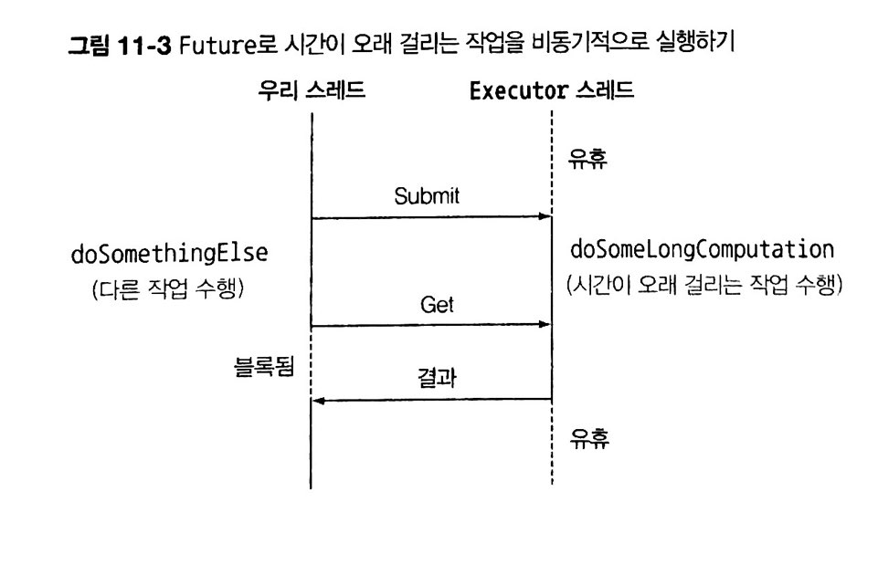

# Java 8 in action chapter 11

## 11.0 INTRO

소프트웨어 구현 방법에 큰 변화를 가져온 두 가지 추세

1. 병렬성
   - 하드웨어의 실행
   - 포크/조인 프레임워크 or 병렬 스트림
2. 동시성
   - 애플리케이션간의 상호작용
   - Future 인터페이스 or CompletableFuture


## 11.1 FUTURE

- 자바에서 비동기를 실행할 수 있도록 도와주는 인터페이스.
- 오래 걸리는 작업을 future 내부로 설정, 그 사이에 다른 작업을 수행.
- 시간이 오래 걸리는 작업을 Callable로 감싼 다음 ExecutorService에 제출.
- ExecutorService에서 제공하는 스레드가 future를 실행해 다른 스레드와 동시에 작업.


```java
// Future로 오래걸리는 작업을 비동기로 실행

// 스레드 풀에 태스크를 제출하기 위해선 ExecutorService를 생성해야 함
ExecutorService executor = Executors.new CachedThreadPool();
// Callable을 ExecutorService로 제출
Future<Double> future = executor.submit(new Callable<Double>() {
    public Double call() {
        // 시간이 오래 걸리는 작업은 다른 스레드에서 비동기적으로 실행.
        return doSomeLongComputation();
    }
});
// 비동기 작업을 수행하는 동안 다른 작업을 실행.
doSomethingElse();
try {
    // 비동기 작업의 결과를 가져옴. 결과가 준비되어 있지 않으면 호출 스레드가 블록됨. 최대 1초까지 기다림.
    Double result = future.get(1, TimeUnit.SECONDS);
} catch (ExceutionException ee) {
    // 계산 중 예외 발생
} catch (InterruptedException ie) {
    // 현재 스레드에서 대기중인 인터럽트 발생
} catch (TimeoutException te) {
    // Future가 완료되기 전에 타임아웃 발생
}
```



**Future의 한계** : 여러개의 Future 결과가 있을 때 서로 의존성을 만들기 힘듦 (ex: A가 끝나고 B를 실행)

**CompletableFuture**

- future 인터페이스의 구현 클래스
- stream과 비슷하게 람다 표현식과 파이프라이닝을 활용
- Future : CompletableFuture = Collection : Stream 


## 11.2 CompletableFuture

**동기 API**

- 블록 호출
- 메서드 호출 후 계산을 완료할 때까지 기다리고 메서드가 반환되면 호출자가 그 값을 가지고 다른 값을 수행
- 호출자와 피호출자가 다른 스레드에 있어도 호출자는 피호출자의 동작 완료를 기다림

**비동기 API**

- 비블록 호출
- 메서드가 즉시 반환, 나머지 작업은 호출자 스레드와 동기적으로 실행 가능하도록 다른 스레드에 할당.
- 나머지 계산 결과는 콜백 메서드 호출 or 호출자가 '계산 완료까지 기다림' 메서드를 추가로 호출
- I/O 시스템 프로그래밍의 동작


### 동기 메서드를 비동기로 변환

최저가 검색 애플리케이션 구현을 위해 각각의 상점에서 제공하는 API.

```java
public class Shop {
    // 제품명에 해당하는 가격 반환하는 메서드. (동기)
    public double getPrice(String product) {
        return calculatePrice(product);
    }

    private double calculatePrice(String product) {
        delay(); // 임의로 딜레이를 주기 위해 1초 지연 함수.
        return random.nextDouble() * product.charAt(0) + product.charAt(1); // 임의의 계산값
    }
}
```


해당 API 호출시 비동기 동작이 완료될 때 까지 1초간 블록이 되기 때문에 **비동기 API로 바꿔보자**

```java
public Future<Double> getPriceAsync(String product) { ... }
```

- Future는 결과값의 핸들일 뿐, 계산이 완료되면 get 메서드로 결과를 얻음.
- getPriceAsync 메서드는 즉시 반환됨.
- **CompletableFuture** 사용.

```java
public Future<Double> getPriceAsync(String product) {
    // 계산 결과를 포함할 CompletableFuture 생성
    CompletableFuture<Double> futurePrice = new CompletableFuture<>();
    new Thread( () -> {
        // 다른 스레드에서 비동기적으로 계산을 수행.
        double price = calculatePrice(product);
        // (오랜 시간이 걸리는)계산이 완료되면 Future에 값을 저장
        futurePrice.complete(price);
    }).start();
    // 바로 Future를 반환
    return futurePrice;
}
```

```java
// 비동기 API 사용
Shop shop = new Shop("BestShop");
long start = System.nanoTime();
// 상점에 제품가격 정보 요청
Future<Double> futurePrice = shop.getPriceAsync("my favorite product");
long invocationTime = ((System.nanoTime() - start) / 1_000_000);
System.out.println("Invocation returned after " + invocationTime 
                                                    + " msecs");
// 제품의 가격을 계산하는 동안 
// 다른 상점 검색 등 다른 작업 수행
doSomethingElse();
try {
    // 가격 정보가 있으면 Future에서 가격 정보를 읽고, 
    // 없으면 가격 정보를 받아올 때까지 블록.
    double price = futurePrice.get();
    System.out.printf("Price is %.2f%n", price);
} catch (ExecutionException | InterruptedException e) {
    throw new RuntimeException(e);
}
long retrievalTime = ((System.nanoTime() - start) / 1_000_000);
System.out.println("Price returned after " + retrievalTime + " msecs");
```


### 에러 처리

중간에 에러가 발생시 해당 스레드만 영향을 미치기 때문에 가격 계산은 진행되며 일의 순서가 꼬임.

결과적으로 클라이언트는 계속 get 메서드의 반환을 기다릴 수도 있음.

예외를 만들어 사용하는 것이 좋음.

```java
CompletableFuture<Double> futurePrice = new CompletableFuture<>();
new Thread( () -> {
    try {
        // 계산이 정상적으로 종료되면 Future에 가격 정보를 저장한채로 Future 종료
        double price = calculatePrice(product);
        futurePrice.complete(price);
    } catch (Exception ex) {
        // 도중 문제가 발생하면 발생한 에러를 포함시켜 Future 종료
        futurePrice.completeExceptionally(ex);
    }
}).start();
return futurePrice;
```


### supplyAsync

```java
// 팩토리 메서드로 위의 코드를 구현
public Future<Double> getPrice(String product) {
    return CompletableFuture.supplyAsync(() -> calculatePrice(product));
}
```

- Supplier를 인수로 받아 CompletableFuture를 반환
- CompletableFuture는 Supplier를 실행, 비동기적으로 결과 생성
- ForkJoinPool의 Executor중 하나가 Supplier를 실행 (명시적으로 Executor 지정도 가능)
- ```에러 처리```와 같은 방법으로 에러를 관리