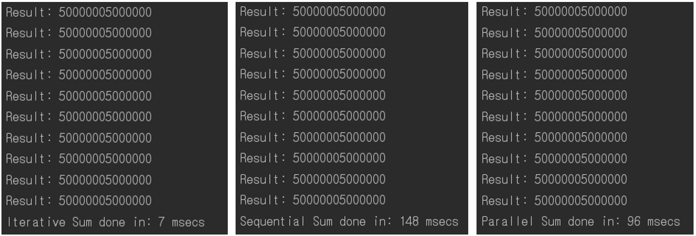
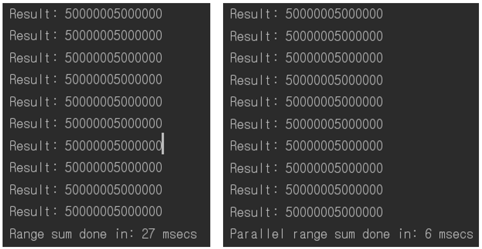
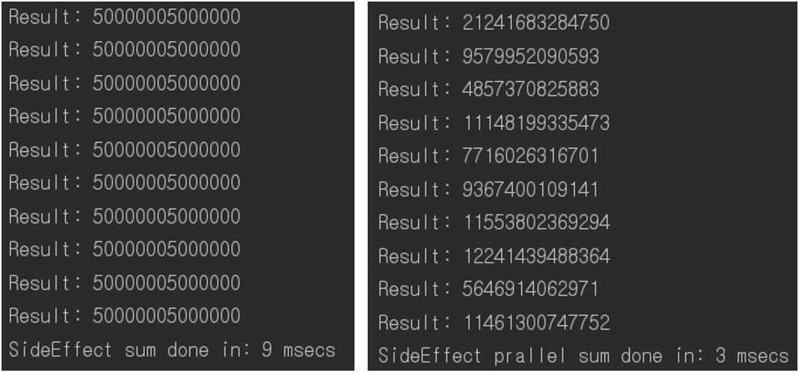
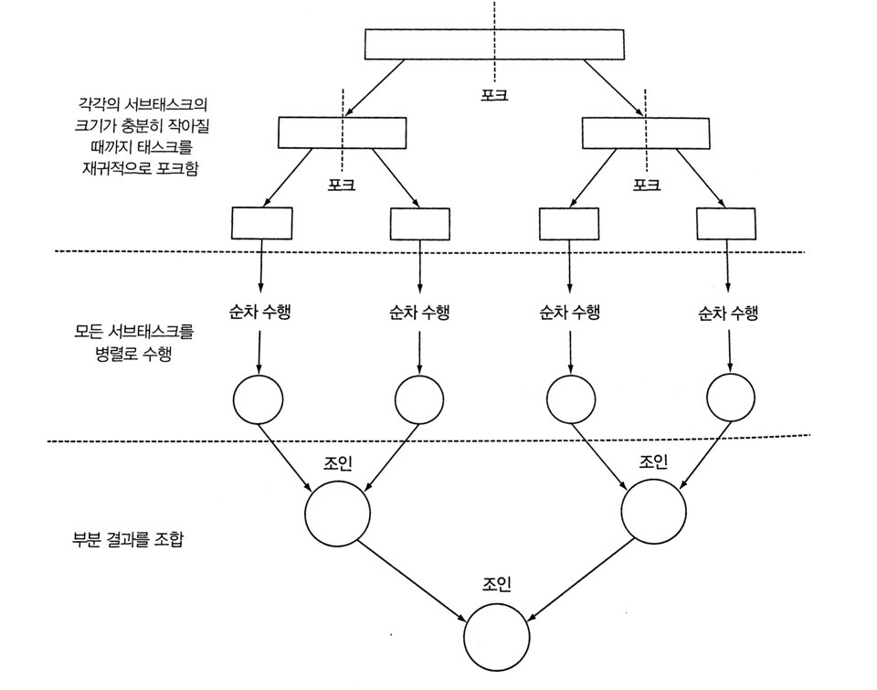
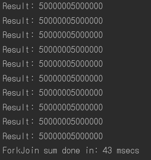
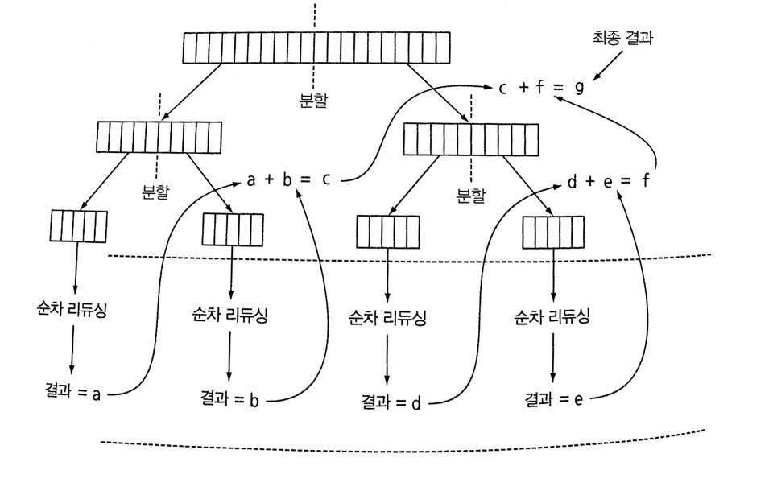
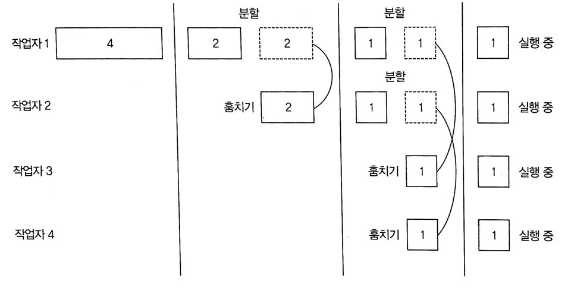
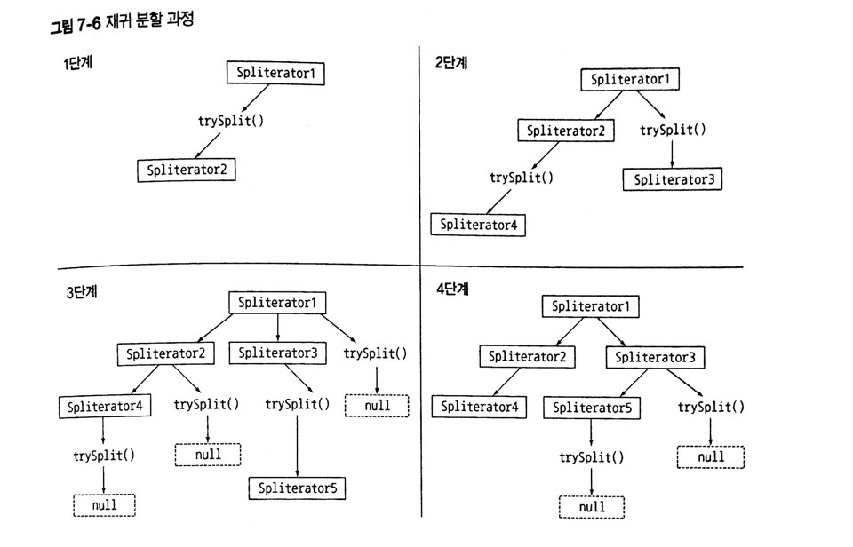
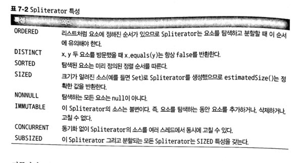
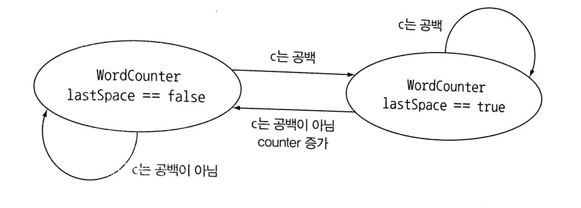

# Java 8 in action chapter 7

## 7.0 INTRO

스트림의 특징 : 

- 개발자가 컬렉션 데이터 처리 속도를 높이기 위해 따로 고민하지 않아도 됨 (외부반복 -> 내부반복)
- **컴퓨터의 멀티코어를 활용할 수 있음**


자바7 이전의 데이터 컬렉션 병렬로 처리 방법 : 

1. 데이터를 서브파트로 나눔
2. 각 서브파트를 쓰레드에 할당
3. 레이스 컨디션이 발생하지 않도록 중간중간 동기화
4. 마지막 결과들 합침

자바7에선 포크/조인 프레임워크 기능을 제공해 에러를 최소화할 수 있도록 만듦.


이번 파트의 쟁점 :

- 병렬 스트림이란 무엇인가

* 포크/조인 프레임워크와 병렬스트림 처리는 어떠한 관계인가
* 병렬스트림이 내부적으로 어떻게 처리되는가
* 병렬 스트림이 요소를 어떻게 여러 청크로 분할하는 가


## 7.1 WHAT IS PARALLELSTREAM

각각의 스레드에서 처리할 수 있도록 스트림 요소들를 여러 청크로 분할한 스트림.

모든 멀티코어 프로세스가 각각의 청크를 처리할 수 있도록 할당할 수 있음.


#### 병렬 스트림 생성 방법

- `parallelStream()` 혹은 `parallel()` 추가

`sequential()`로 순차 스트림으로 바꿀 수 있으나, 

마지막에 호출된 메서드가 전체 파이프라인에 영향을 끼침.

아래 코드에서 마지막 호출은 `parallel()` 이므로 전체 파이프라인은 병렬로 실행

```java
stream.parallel()
    .filter(...)
    .sequential()
    .map(...)
    .parallel()
    .reduce();
```


#### 스트림 성능 측정

숫자 합계 예제를 반복형, 순차스트림, 병렬스트림으로 구현해 각각의 성능을 비교

 (스트림은 iterate로 생성)

```java
// 반복형
public static long iterativeSum(long n) {
    long result = 0;
    for (long i = 0; i <= n; i++) {
        result += i;
    }
    return result;
}
```

```java
// 순차 스트림
public static long sequentialSum(long n) {
    return Stream.iterate(1L, i -> i + 1)
        .limit(n).reduce(Long::sum).get();
}
```

```java
// 병렬 스트림
public static long parallelSum(long n) {
    return Stream.iterate(1L, i -> i + 1)
        .limit(n).parallel().reduce(Long::sum).get();
}
```

```java
// 실행
System.out.println("Iterative Sum done in: " + measurePerf(ParallelStreams::iterativeSum, 10_000_000L) + " msecs");
        System.out.println("Sequential Sum done in: " + measurePerf(ParallelStreams::sequentialSum, 10_000_000L) + " msecs");
        System.out.println("Parallel Sum done in: " + measurePerf(ParallelStreams::sequentialSum, 10_000_000L) + " msecs");
```



결과 : iterator > paralle > sequential

이유 : 

- for 루프는 저수준으로 돌며 기본값을 **박싱/언박싱**할 필요가 없음.
- **iterate는 본질적으로 순차적. (병렬로 실행될 수 있는) 독립적인 청크로 분할하기 어려움.**

iterate는 이전 연산의 결과에 따라 다음 함수의 입력이 달라지기 때문에 청크로 분할하기 어려움.

**병렬은 언제나 빠른게 아니며 특화된 메서드를 사용해야 함.**


#### 박싱/언박싱 오버헤드를 줄이자

`LongStream.rangeClosed()`를 사용하면 박싱/언박싱의 오버헤드를 줄일 수 있음.

```java
// LongStream.rangeClosed 사용한 순차 스트림
public static long rangedSum(long n) {
    return LongStream.rangeClosed(1, n)
        .reduce(Long::sum).getAsLong();
}
```

```java
// LongStream.rangeClosed 사용한 병렬 스트림
public static long parallelRangedSum(long n) {
    return LongStream.rangeClosed(1, n)
        .parallel()
        .reduce(Long::sum).getAsLong();
}
```



드디어 빨라졌다.

아무튼 병렬화는 공짜가 아니며, 스트림을 병렬화를 이용해서 코드 실행 속도를 빠르게 하고싶으면 항상 병렬화를 올바르게 사용하고 있는지 확인해야함.


#### 공유된 가변 상태는 피하자 

병렬 스트림을 잘못 사용하면서 발생하는 많은 문제는 **공유된 상태를 바꾸는 알고리즘을 사용**하기 때문.

```java
// n까지의 자연수를 더하면서 공유된 누적자를 바꾸는 코드
public static class Accumulator {
    private long total = 0;

    public void add(long value) {
        total += value;
    }
}

public static long sideEffectSum(long n) {
    Accumulator accumulator = new Accumulator();
    LongStream.rangeClosed(1, n).forEach(accumulator::add);
    return accumulator.total;
}
```

위의 코드를 병렬로 실행하면 참사가 발생함.

```java
public static long sideEffectParallelSum(long n) {
    Accumulator accumulator = new Accumulator();
    LongStream.rangeClosed(1, n).parallel().forEach(accumulator::add);
    return accumulator.total;
}
```



위의 코드는 `forEach` 블록 안에서 (여러 스레드가 공유하는) **객체의 상태를 바꾸는** `add` 메서드를 호출해 문제가 발생한다.  때문에 올바른 값을 얻기 위해서는 병렬 스트림과 병렬 계산에선 **공유된 가변 상태를 피해야** 한다.


> 아토믹 연산이란? 
>
> 중단되지 않는 연산을 의미하며, 언제나 동기화가 되는 연산이다. 이번 경우엔 여러 스레드에서 `total` 값에 동시에 접근하므로 `total += value` 는 동기화를 보장하지 못하므로 아토믹 연산이 아니다.


> 데이터 레이스
>
> 다수의 스레드에서 동시에 데이터에 접근하는 상태이다. 보안적으로도 취약해 문제를 해결해야한다.


#### 병렬 스트림을 효과적으로 사용하기

- 무조건 측정측정충성충성

- 박싱 주의. 기본형 특화 스트림(`IntStream`, `LongStream`, `DoubleStream`)을 사용.

- 성능이 떨어지는 연산이 있음. 요소의 순서에 의존하면 느리기때문에 `findFirst`보단 `findAny`를, 

  순서가 상관 없다면 스트림에 `unoredered` 호출 뒤 `limit`을 호출.

- 전체 파이프라인 연산 비용을 고려. 처리해야할 요소 수 = N , 하나의 요소 처리 비용 = Q 일 때 연산은 N*Q. 이때 Q가 크다면 병렬스트림으로 성능을 개선할 가능성이 있음.

- 소량은 도움이 되지 못함. 병렬화 과정에서 생기는 부가비용을 상쇄하지 못하기 때문에...

- 적절한 자료구조인지 판단이 필요. 분해가 용이한 자료구조들이 있는데 `ArrayList`가 `LinkedList`보다 용이하고, `range` 팩토리 메서드로 만든 기본형 스트림도 쉽게 분해 가능. (물론 `Spliterator`를 구현해 분해 과정을 완벽하게 제어가 가능.)

- 중간 연산이 스트림을 어떻게 바꾸는지에 따라 분해 과정 성능이 달라짐. `SIZE` 스트림은 같은 크기의 두 스트림을 분할할 수 있어서 효과적. 하지만 `fiter`는 스트림 길의 값을 예측할 수 없어서 효과 여부를 알 수 없음.

- 최종 연산 병합 과정 비용 살피기. 병합과정 연산이 비싸면 서브 스트림의 부분 결과를 합치는 과정에서 상쇄될 수도 있음.


일단 병렬스트림을 효과적으로 살펴보기 위해선 내부 인프라 구조를 살펴봐야함. (바로 포크/조인 프레임워크!)

스트림 소스와 분해성 친밀도 표

| 소스              | 분해성 |
| ----------------- | ------ |
| `ArrayList`       | 훌륭함 |
| `LinkedList`      | 나쁨   |
| `IntStream.range` | 훌륭함 |
| `Stream.iterate`  | 나쁨   |
| `HashSet`         | 좋음   |
| `TreeSet`         | 좋음   |


## 7.2 FORK/JOIN FRAMEWORK

1. 병렬화 할 수 있는 작업을 **재귀적으로 작은 단위로** **분할**
2. **서브태스크** 각각의 결과를 합쳐 **전체 결과를 만듦.**
3. ExecutorService 인터페이스 구현
   1. 서브태스크를 스레드 풀(ForkJoinPool)의 작업자 스레드에 분산 할당


> 스레드 풀(ForkJoinPool)의 스레드 설정
>
> 프로세서 수, 
>
> 즉 Runtime.getRuntime().availableProcessor()가 반환하는 값에 상응하는 스레드를 가진다.


#### RecursiveTask 활용

스래드 풀을 이용하려면 **RecursiveTask<R>**의 서브 클래스를 만들어야 함.

* R : 병렬화된 태스크가 생성하는 결과 형식 (결과가 없을 때는 RecursiveAction 형식)

RecursiveTask를 정의하기 위해선 추상메서드 compute를 구현해야 함.

**compute**의 로직

1. 태스크를 서브태스크로 분할
2. (더 이상 분할할 수 없을 경우) 서브 태스크의 결과를 생산할 알고리즘을 정의
3. 분할 후 정복 알고리즘의 병렬화 버전

```java
if (태스크가 충분히 작거나 더 이상 분할할 수 없으면) { // 정해진 기준은 없으나 추천 데이터는 존재
    순차적으로 태스크 계산
} else {
    태스크를 두 서브태스크로 분할
    태스크가 다시 서브태스크로 분할되도록 이 메소드를 재귀적으로 호출함
    모든 서브태스크의 연산이 완료될 따까지 기다림
    각 서브태스크의 결과를 합침
}
```

포크/조인 과정




n까지의 자연수 덧셈 예제

```java
// RecursiveTask를 상속받아 포크/조인 프레임워크에서 사용할 태스크를 생성
public class ForkJoinSumCalculator extends RecursiveTask<Long> {

    // 이 값 이하의 서브태스크는 더 이상 분할할 수 없다.
    public static final long THRESHOLD = 10_000;

    private final long[] numbers;
    private final int start;
    private final int end;

    // 메인 테스크를 생성할 때 사용할 공개 생성자
    public ForkJoinSumCalculator(long[] numbers) {
        this(numbers, 0, numbers.length);
    }

    // 메인 테스크의 서브태스크를 재귀적으로 만들 때 사용할 비공개 생성자
    private ForkJoinSumCalculator(long[] numbers, int start, int end) {
        this.numbers = numbers;
        this.start = start;
        this.end = end;
    }

    // RecursiveTask의 추상화 오버라이드
    @Override
    protected Long compute() {
        int length = end - start;				// 이 태스트크에서 더할 배열의 길이
        if (length <= THRESHOLD) {				// 기준값과 같거나 작으면 순차적으로 계산
            return computeSequentially();
        }
        // 배열의 첫 번째 절반을 더하도록 서브태스크를 생성한다.
        ForkJoinSumCalculator leftTask = new ForkJoinSumCalculator(numbers, start, start + length/2);
        // ForkJoinPool의 다른 스레드로 새로 생성한 태스크를 비동기로 실행한다.
        leftTask.fork();
        // 배열의 나머지 절반을 더하도록 서브태스크를 생성한다.
        ForkJoinSumCalculator rightTask = new ForkJoinSumCalculator(numbers, start + length/2, end);
        // 두 번째 서브태스크를 동기 실행한다. 이때, 추가로 분할이 일어날 수 있다.
        Long rightResult = rightTask.compute();
        // 첫 번째 서브태스크의 결과를 읽거나 아직 결과가 없으면 기다린다.
        Long leftResult = leftTask.join();
        // 두 서브태스크의 결과를 조합한 값이 이 태스크의 결과.
        return leftResult + rightResult;
    }

    // 더 분할할 수 없을 때 서브태스크의 결과를 계산하는 단순 알고리즘
    private long computeSequentially() {
        long sum = 0;
        for (int i = start; i < end; i++) {
            sum += numbers[i];
        }
        return sum;
    }

    // 실행하는 함수
    public static long forkJoinSum(long n) {
        long[] numbers = LongStream.rangeClosed(1, n).toArray();
        ForkJoinTask<Long> task = new ForkJoinSumCalculator(numbers);
        return FORK_JOIN_POOL.invoke(task);
    }
}
```

```java
System.out.println("ForkJoin sum done in: " + measurePerf(ForkJoinSumCalculator::forkJoinSum, 10_000_000L) + " msecs" );
```



병렬스트림을 이용할 때보다 성능이 나빠진 이유는 전체스트림을 long[]으로 변환했기 때문

애플리케이션에선 둘 이상의 ForkJoinPool을 사용하지 않음. 소프트웨어의 필요한 곳에서 언제든 가져다 쓸 수 있도록 ForkJoinPool을 한 번만 인스턴스화해서 싱글턴으로 저장. 인수가 없는 디폴트 생성자를 이용한 것은, JVM에서 이용할 수 있는 모든 프로세서가 자유롭게 풀에 접근할 수 있음을 의미.

```java
public static final ForkJoinPool FORK_JOIN_POOL = new ForkJoinPool();

public static long forkJoinSum(long n) {
    long[] numbers = LongStream.rangeClosed(1, n).toArray();
    ForkJoinTask<Long> task = new ForkJoinSumCalculator(numbers);
    return FORK_JOIN_POOL.invoke(task); //싱글턴 사용
}
```


**ForkJoinSumCalculator 실행**

1. ForkJoinSumCalculator를 ForkJoinPool로 전달하면
2. 풀의 스레드가 ForkJoinSumCalculator의 compute 메서드를 실행하며 작업을 수행
3. compute는 병렬로 실행할 수 있을 만큼 태스크가 충분히 작아졌는지 확인
4. 아직 태스크의 크기가 크다고 판단 -> 배열을 반으로 분할해 두 개의 새로운 ForkJoinSumCalculator로 할당
5. 이 과정을 재귀적으로 반복하며 주어진 조건을 만족할 때 까지 태스크 분할을 반복
6. 서브태스크는 순차적으로 처리, 포킹 프로세스로 만들어진 이진트리의 태스크를 루트에서 역순으로 방문
7. 서브태스크의 부분 결과를 합쳐서 태스크의 최종 결과를 계산



#### 포크/조인 프레임워크를 효과적으로 사용하기

포크/조인 프레임워크는 쉽게 사용할 수 있지만 항상 주의를 기울여야 함.

* 두 서브태스크가 모두 시작된 다음에 join 메서드를 호출하기. join 메서드를 태스크에서 호출하면 태스크가 생산하는 결과가 준비될때까지 호출자를 블록시키기 때문에 각각의 서브태스크가 다른 태스크가 끝나길 기다리는 일이 발생할 수 있음.
* RecursiveTask 내에서 ForkJoinPool의 invoke 메서드를 사용하지 않기. 순차코드에서 병렬 계산을 시작할 때만 invoke를 사용(compute나 fork 메서드는 가능)
* 서브태스크에서 fork 메서드를 호출해 ForkJoinPool의 일정을 조절 가능. 왼쪽작업과 오른쪽 작업 모두에 fork 메서드를 호출하는게 자연스러울거 같지만, 한쪽 작업에는 fork보단 compute를 호출하는게 효율적. 그럼 두 서브태스크의 한 태스트에는 같은 스레드를 재사용할수 있어 불필요한 태스크를 할당하는 오버헤드를 피할 수 있음
* 포크/조인 프레임워크를 이용하는 병렬 계산은 디버깅하기 어려움. 보통 IDE로 디버깅할 땐 스택 트레이스로 문제가 일어난 과정을 쉽게 확인할 수 있는데, 포크/조인 프레임워크에서는 fork라 불리는 다른 스레드에서 compute를 호출해 스택 트레이스가 도움되지 않음.
* 멀티코어에서 포크/조인 프레임워크가 순차보다 무조건 빠를거라는 생각은 버려야 함.


#### 작업 훔치기

컴퓨터 코어의 숫자보다 서브태스크의 개수가 더 많아 자원을 낭비하는 것 같이 보일 수 있음.

(천만 개 항목을 포함하는 배열을 사용한다면 ForkJoinSumCalculator는 천개 이상의 서브태스크를 포크할텐데 대부분의 기기에는 코어가 네 개 뿐.)

**하지만 코어의 개수와 상관없이 적절한 크기로 분할된 많은 태스크를 포킹하는 것이 바람직.**

왜냐하면 **풀에 있는 작업자 스레드의 태스크를 재분배하고 균형을 맞출 때 작업 훔치기 알고리즘을 사용하기 때문.**

포크/조인 프레임워크에서 사용하는 작업 훔치기 알고리즘



* 작업자의 큐에 있는 태스크를 두 개의 서브 태스크로 분할했을 때 둘 중 하나의 태스크를 다른 유휴 작업자가 훔쳐갈 수 있음
* 주어진 태스크를 순차 실행할 단계가 될 때까지 이 과정을 재귀적으로 반복


## 7.3 Spliterator

분할 할 수 있는 반복자.

Iterator처럼 소스의 요소 탐색 기능을 제공하지만 병렬 작업에 특화.

자바8은 디폴트 Spliterator 구현을 제공

항상 커스텀을 구현해야할 필요는 없지만 Spliterator가 어떻게 동작하는지 이해한다면 병렬 스트림 동작과 관련한 통찰력을 얻을 수 있음.

```java
// Spliterator 인터페이스
public interface Spliterator<T> {
    boolean tryAdvance(Consumer<? super T> action);
    Spliterator<T> trySplit();
    long estimateSize();
    int characteristics();
}
```

* tryAdvance : 요소를 소비하며 탐색해야할 요소가 남아있으면 참을 반환(일반적인 Iterator 동작과 동일)
* trySplit : Spliterator의 일부 요소를 분할해 두 번째 Spliterator를 생성
* estimateSize : 탐색해야 할 요소 수 정보를 제공. 탐색할 요소 수가 정확하진 않아도 제공된 값을 이용해 쉽고 공평하게 Spliterator를 분할 할 수 있음.
* characteristics :  분할 과정에 영향을 끼치며, Spliterator 자체의 특성 집합을 포함하는 int를 반환. 이들 특성을 참고해 Spliterator를 더 잘 제어하고 최적화할 수 있음.


**분할 과정**



**Spliterator 특성**




#### 커스텀 Spliterator 구현하기

문자열의 단어 수를 계산하는 메서드를 통해 확인

```java
// 반복형
public static int countWordsIteratively(String s) {
    int counter = 0;
    boolean lastSpace = true;
    for (char c : s.toCharArray()) {
        if (Character.isWhitespace(c)) {
            lastSpace = true;
        } else {
            if (lastSpace) counter++;
            lastSpace = Character.isWhitespace(c);
        }
    }
    return counter;
}
```

```java
public static final String SENTENCE =
            " Nel   mezzo del cammin  di nostra  vita " +
            "mi  ritrovai in una  selva oscura" +
            " che la  dritta via era   smarrita ";

System.out.println("Found " + countWordsIteratively(SENTENCE) + " words");
```

**함수형으로 재구현하기**

```java
Stream<Character> stream = IntStream.range(0, SENTENCE.length())
    								.mapToObj(SENTENCE::charAt)
```

스트림에 리듀싱 연산을 실행하며 단어 수를 계산하기 위해선 아래의 변수가 포함된 새로운 클래스가 필요

- 지금까지 발견한 단어 수 계산 int 변수
- 마지막 문자가 공백이었는지 여부를 기억하는 Boolean 변수

```java
class WordCounter {
    private final int counter;
    private final boolean lastSpace;
    
    public WordCounter(int counter, boolean lastSpace) {
        this.counter = counter;
        this.lastSpace = lastSpace;
    }
    
    // 반복 알고리즘처럼 accumulate 메서드는 문자열의 문자를 하나씩 탐색
    public WordCounter accumulate(Character c) {
        if (Character.isWhitespace(c)) {
            return lastSpace ? this : new WordCounter(counter, true);
        } else {
            // 문자열을 하나씩 탐색하다가 문자를 만나면 지금까지 탐색한 문자를 단어로 간주해 단어 개수를 증가(공백 문자는 제외)
            return lastSpace ? new WordCounter(counter + 1, false) : this;
        }
    }
    
    // 두 WordCounter의 counter값을 더한다.
    public WordCounter combine(WordCounter wordCounter) {
        // counter값만 더할 것이므로 마지막 공백은 신경쓰지 않는다.
        return new WordCounter(counter + wordCounter.counter, wordCounter.lastSpace);
    }
    
    public int getCounter() {
        return counter;
    }
}
```

```java
// 순차 스트림으로 구현
private int countWords(Stream<Character> stream) {
    WordCounter wordCounter = stream.reduce(new WordCounter(0, true),
                                           WordCounter::accumulate,
                                           WordCounter::combine);
    return wordCounter.getCounter();
}
```

```java
// 실행
Stream<Character> stream = Intstream.range(0, SENTENCE.length())
    								.mapToObj(SENTENCE.charAt);
System.out.println("Found " + countWords(stream) + "words ");

// 병렬 스트림으로 처리하면 값이 제대로 나오지 않음
System.out.println("Found " + countwords(stream.parallel() + "words "));
```

새로운 문자 C를 탐색했을 때 WordCounter의 상태 변화



하지만 병렬로 수행하면 원하는 결과가 나오지 않음. 문자열을 임의의 위치에서 둘로 나누다보니 예상치 못하게 하나의 단어를 둘로 계산하는 상황이 발생할 수 있기 때문. 

따라서 **단어가 끝나는 위치에서만 분할하는 방법**으로 바꿔야함. (**Spliterator 구현**)

```java
// WordCounterSpliterator
private static class WordCounterSpliterator implements Spliterator<Character> {

    private final String string;
    private int currentChar = 0;

    private WordCounterSpliterator(String string) {
        this.string = string;
    }

    @Override
    public boolean tryAdvance(Consumer<? super Character> action) {
        // 현재 문자를 소비
        action.accept(string.charAt(currentChar++));
        // 소비할 문자가 남아있으면 true로 반한
        return currentChar < string.length();
    }

    @Override
    public Spliterator<Character> trySplit() {
        int currentSize = string.length() - currentChar;
        if (currentSize < 10) {
            //파싱할 문자열이 순차 처리할 수 있을만큼 충분히 작아졌음을 알리는 null을 반환
            return null;
        }
        // 파싱할 문자열의 중간을 분할 위치로 설정
        for (int splitPos = currentSize / 2 + currentChar; splitPos < string.length(); splitPos++) {
            // 다음 공백이 나올 때 까지 분할 위치를 뒤로 이동
            if (Character.isWhitespace(string.charAt(splitPos))) {
                Spliterator<Character> spliterator = new WordCounterSpliterator(string.substring(currentChar, splitPos));
                // 이 WordCounterSpliterator의 시작 위치를 분할 위치로 설정
                currentChar = splitPos;
                return spliterator;
            }
        }
        return null;
    }

    @Override
    public long estimateSize() {
        return string.length() - currentChar;
    }

    @Override
    public int characteristics() {
        return ORDERED + SIZED + SUBSIZED + NONNULL + IMMUTABLE;
    }
}
```

```java
// Spliterator를 사용한 병렬 스트림
Spliterator<Character> spliterator = new WordCounterSpliterator(SENTENCE);
Stream<Character> stream = StreamSupport.stream(spliterator, true)
```


늦은 바인딩 Spliterator : 

* 첫 번째 탐색 시점
* 첫 번째 분할 시점
* 첫 번째 예상 크기(estimatedSize) 요청 시점

에서 요소의 소스를 바인딩 할 수 있음